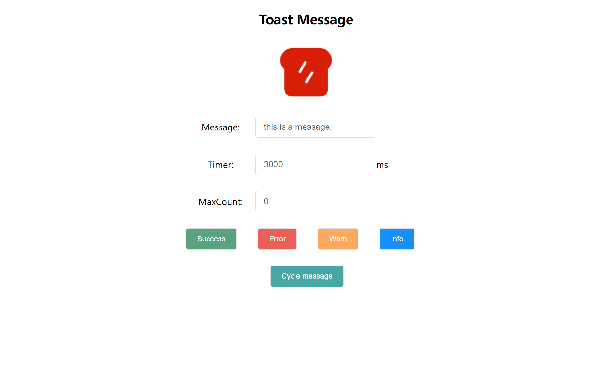

# toast

> 简单易用的经典Toast消息弹窗，利用css动画实现流畅的动画效果，代码不到200行，原生js编写，不依赖任何第三方库，随用随插。


##  效果预览

> 以下展示效果可克隆本项目后在本地体验。

+ 自动关闭的不同类型的消息弹窗

  

+ 不自动关闭的消息弹窗

  

+ 可执行回调的嵌入文案按钮

  

## 快速使用

安装本项目到本地，可预览效果拷贝脚本文件。

```shell
git clonegit@github.com:fongzhizhi/toast.git
```

安装项目所需模块：

```shell
npm install
```

编译并启动项目：

```shell
# 本地启动
npm run dev
# 生成环境启动
npm run prod
```

在`dist`目录下，我们得到了`Toast`组件的脚本文件：`Toast.js`或`Toast.min.js`。

记得同时拷贝消息组件所需的样式文件和字体文件。

如果你需要源文件，只需拷贝`src/Toast.ts`到你的项目中即可，由于代码量极小，你大可自由发挥，改造成自己喜欢的消息弹窗。

### API

`Toast`接受三个参数的配置，最简单的使用如下：

```js
new Toast({
    /**消息类型 */
    type: 'success',
    /**消息体 */
    msg: 'This is a success message.',
    /**自动关闭的时间 */
    timer: 3000,
});
```

#### 消息类型

提供四种消息类型：

```ts
export enum ToastType {
  /**成功 */
  Success = "success",
  /**失败|错误 */
  Error = "error",
  /**警告 */
  Warn = "warn",
  /**信息 */
  Info = "info",
}
```

#### 消息体

消息体可以接受多种数据类型，可以是`ToastMsgItem`项，也可以是`ToastMsgItem`的数组，`ToastMsgItem`数据结构如下：

```ts
/**消息项 */
export type ToastMsgItem = string | ToastMsgBody;

/**
 * Toast消息体
 */
export interface ToastMsgBody {
  /**消息文本 */
  text: string;
  /**消息回调 */
  call?: Function;
  /**附加的类名 */
  class?: string;
}
```

#### 自动关闭时间

单位为毫秒。如果设置为0，则消息面板不会自动关闭，需要手动关闭。

### 全局设置

`Toast`消息有一些默认处理逻辑，如果你想改变这些预设逻辑，可以参考下面的用法。

#### 重置消息面板容器

默认地，`Toast`消息面板会自动创建一个`id="toast-container"`的容器，并固定与页面顶部居中的位置。如果你希望你的消息在其他位置显示，就可以重置容器。有两种做法：

+ 利用js：提供一个新的容器

  ```js
  const selectors = '#newContainer';
  Toast.setContainer(selectors);
  ```

+ 利用css：修改默认容器的到指定的位置

  利用修改默认容器的位置即可。

#### 设置最大的可展示消息数量

有时候我们不希望显示的消息太多，这时候我们可以设置消息最大可现实数量，当容器中的消息数量超过预设的最大值时，最先出现的消息面板将会被直接关闭。

```js
const num = 5;
Toast.setMaxCount(num); // 预设消息最大可展示数量
```

#### 动画效果的更改

动画效果通过`css`的过渡动画控制，如果需要修改动画，覆盖默认的css样式即可。
